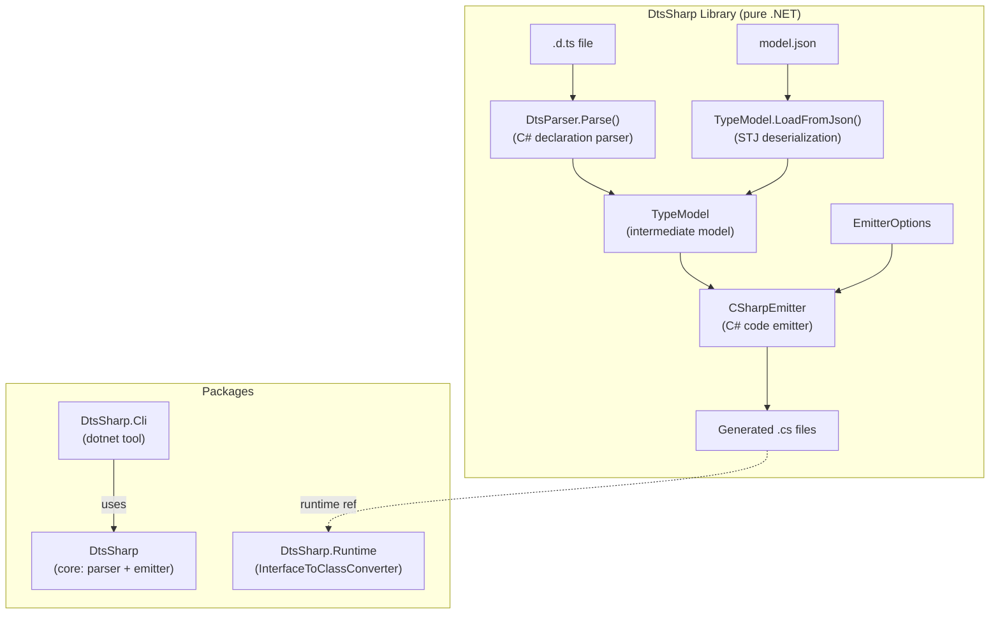

# Extract Emitter as General-Purpose .d.ts → C# Source Generator Library

## Overview

Extract the Monaco type emitter (`tools/MonacoTypeEmitter/`) into a standalone, general-purpose .NET library that converts TypeScript `.d.ts` declaration files into C# proxy/wrapper source files. The library must be pure .NET with **no Node.js/npm dependencies**.

### Current state
The existing pipeline is two stages:
1. **ts-morph extractor** (Node.js) — parses `.d.ts` → intermediate JSON model
2. **.NET CLI emitter** — reads JSON → emits C# files

Research shows the emitter is ~90% generic already. The intermediate JSON schema (`model.ts` / `MonacoModel.cs`) is fully language-agnostic. Only ~6 coupling points are Monaco-specific (hardcoded paths, converter references, TypeDoc URLs, root namespace stripping).

### Target state
A standalone NuGet-packaged .NET library + CLI tool that:
- Accepts `.d.ts` files directly as input (no Node.js required)
- Parses declarations via a purpose-built C# parser for the `.d.ts` subset of TypeScript
- Emits C# proxy types (interfaces, classes, enums, type aliases) with STJ serialization attributes
- Is configurable via an options object (namespaces, type mappings, doc links, converter references)
- Ships a small runtime companion package for emitted code dependencies (`InterfaceToClassConverter`)

## Scope

**In scope:**
- New standalone solution with library, CLI tool, runtime, and parser projects
- C# declaration parser for `.d.ts` files (interfaces, classes, enums, type aliases, functions, namespaces, generics, unions/intersections, literals)
- Decoupled emitter with `EmitterOptions` configuration (emission concerns only)
- Runtime NuGet package for `InterfaceToClassConverter`
- CLI tool packaged as `dotnet tool` (file I/O, ignore list loading, output directory management)
- Migration of `uno.monaco.editor` to consume the extracted library
- Test suite with non-Monaco fixtures from 3 real library `.d.ts` files

**Out of scope (deferred):**
- Roslyn incremental source generator (future enhancement — reads JSON via `AdditionalTextsProvider`)
- Full TypeScript type checker (the parser extracts declarations, not semantic analysis)
- Declaration merging across multiple files (v1 handles single-file `.d.ts`)
- Construct signatures (not in current intermediate model)

## Design boundaries

**Library API (dual input):**
- `DtsParser.Parse(string dtsContent)` → `TypeModel` (parse `.d.ts` directly)
- `TypeModel.LoadFromJson(string json)` / STJ deserialization → `TypeModel` (load intermediate JSON)
- Both input paths produce the same `TypeModel` consumed by the emitter

**Emitter options** control emission behavior only:
- `RootNamespace`, `InterfaceConverterTypeName`, `DocLinkProvider`, `OutputPathPrefix`

**CLI options** control file I/O and tooling:
- `--input`, `--output`, `--ignore-file`, `--root-namespace`, `--converter-type`, `--no-docs`

## Dependencies

- **fn-10** (Fix emitter edge cases, XML docs) — should complete first.

## Quick commands

```bash
# Build the library
dotnet build tools/DtsSharp/DtsSharp.slnx

# Run tests
dotnet test --project tools/DtsSharp/DtsSharp.Tests

# CLI usage: parse .d.ts and emit C#
dotnet run --project tools/DtsSharp/DtsSharp.Cli -- --input path/to/api.d.ts --output Generated/

# From uno.monaco.editor — regenerate Monaco types
dotnet run --project tools/DtsSharp/DtsSharp.Cli -- --input node_modules/monaco-editor/monaco.d.ts --output MonacoEditorComponent/Monaco/ --ignore-file tools/DtsSharp/monaco.generator-ignore
```

## Acceptance

- [ ] Standalone library compiles and passes all tests with zero Monaco references in public API
- [ ] Library exposes dual input: `DtsParser.Parse()` for `.d.ts` and JSON deserialization for intermediate model
- [ ] CLI tool accepts a `.d.ts` file and emits C# without Node.js
- [ ] `uno.monaco.editor` regenerated output is byte-for-byte identical using the extracted library (task 7 resolves any interim diffs before task 6 finalizes parity)
- [ ] Runtime companion package contains `InterfaceToClassConverter` in a generic namespace
- [ ] Emitter is configurable via `EmitterOptions`: root namespace, output prefix, converter type name, doc link provider
- [ ] CLI handles file I/O concerns: ignore-file loading, output directory, input format detection
- [ ] `.d.ts` parser handles: interfaces, classes, enums, type aliases (string literal unions), functions, namespaces, generic type parameters (with defaults and constraints), union/intersection types, array types, literal types, optional/readonly members, `typeof` queries
- [ ] Parser has deterministic fallback rules for unsupported constructs (mapped types, template literals, conditional types, infer, rest elements)
- [ ] Test suite includes fixtures from at least 3 real non-Monaco library `.d.ts` files
- [ ] CLI is packable as a `dotnet tool`
- [ ] At least one test validates generated code works against `DtsSharp.Runtime` converter

## Architecture



## Key design decisions

1. **Parser strategy**: Build a focused C# parser for `.d.ts` declaration syntax. `.d.ts` files contain only declarations (bounded grammar). Split into core grammar (task 4) and edge construct hardening (task 7).

2. **Dual input at library level**: The library exposes both `DtsParser.Parse()` and JSON deserialization. Both produce `TypeModel`. This preserves backward compatibility and lets users with complex `.d.ts` setups use the ts-morph extractor to produce JSON.

3. **Package structure**: Three NuGet packages — core library (parser + emitter), runtime (converter), CLI tool.

4. **EmitterOptions pattern**: Emission concerns only. File I/O stays in CLI layer.

5. **Parity gate**: Task 7 resolves all parser diffs against Monaco baseline. Task 6 verifies byte-for-byte identical output. No "acceptable diffs" at final migration.

6. **Naming**: `DtsSharp` as working name. CLI flag: `--ignore-file`.

## References

- Current emitter: `tools/MonacoTypeEmitter/Emitter/CSharpEmitter.cs`
- Current model: `tools/MonacoTypeEmitter/Model/MonacoModel.cs` (C#), `tools/monaco-type-extractor/src/model.ts` (TS)
- Type mapper: `tools/MonacoTypeEmitter/Emitter/TypeMapper.cs`
- Name mapper: `tools/MonacoTypeEmitter/Emitter/NameMapper.cs`
- Test infrastructure: `tools/MonacoTypeEmitter.Tests/`
- InterfaceToClassConverter: `MonacoEditorComponent/Helpers/InterfaceToClassConverter.cs`
