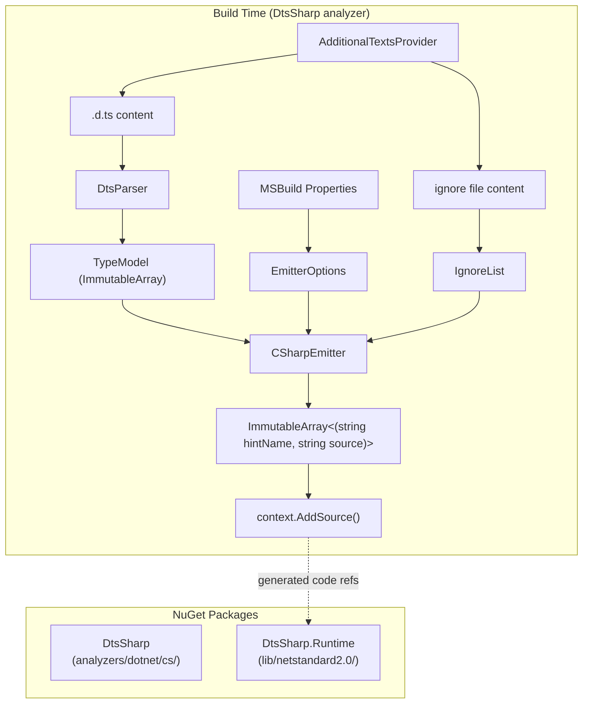

# General-Purpose .d.ts → C# Roslyn Source Generator

## Overview

Extract the Monaco type emitter into a standalone Roslyn incremental source generator that converts TypeScript `.d.ts` declaration files into C# proxy types at compile time. Pure .NET, no Node.js, no CLI — consumers just add a NuGet package and their `.d.ts` file.

### Consumer experience

```xml
<PackageReference Include="DtsSharp" />
<AdditionalFiles Include="api.d.ts" />
```

At build time, the source generator reads the `.d.ts`, parses it in C#, and emits typed C# proxies directly into the compilation. No separate build step.

### Current state

The existing pipeline is two stages: ts-morph (Node.js) parses `.d.ts` → JSON, then a .NET CLI emitter reads JSON → emits C# files. The emitter is ~90% generic already with only ~6 Monaco-specific coupling points.

### Target state

Two NuGet packages:
- **DtsSharp** — Roslyn `IIncrementalGenerator` analyzer package. Contains the .d.ts parser + C# emitter. Targets `netstandard2.0` (with potential Roslyn-version-specific builds for perf).
- **DtsSharp.Runtime** — Small runtime package with `InterfaceToClassConverter` and any other types that generated code references.

## Scope

**In scope:**
- Roslyn incremental source generator reading `.d.ts` via `AdditionalTextsProvider`
- C# declaration parser for `.d.ts` (interfaces, classes, enums, type aliases, functions, namespaces, generics, unions/intersections)
- Decoupled emitter with configurable options (via MSBuild properties)
- Pure emit-to-memory API — emitter returns `(hintName, source)` pairs with zero I/O side effects
- Runtime NuGet package for `InterfaceToClassConverter`
- Analyzer NuGet packaging (`analyzers/dotnet/cs/`)
- Exclusion support via `AdditionalFiles`-based ignore file for filtering generated types
- Migration of `uno.monaco.editor` to consume the source generator
- Test suite with non-Monaco `.d.ts` fixtures

**Out of scope:**
- CLI tool (no executable)
- JSON intermediate format for consumers
- Full TypeScript type checker
- Multi-file `.d.ts` with `/// <reference>` following (v1 = single file)
- Construct signatures (not in intermediate model)

**Multiple `.d.ts` files (v1 behavior):** If multiple `.d.ts` files appear in `AdditionalFiles`, the generator processes each independently and emits types per file. Hint names are prefixed with source file name to avoid collisions. Duplicate symbol diagnostics are reported.

## Task dependency graph

```
.1 (scaffold + extract + runtime)
├── .2 (decouple emitter)     ← can run in parallel with .4
├── .4 (parser core grammar)  ← can run in parallel with .2
│
├── .3 (wire IIncrementalGenerator) ← blocked by .2 AND .4
│   └── .5 (test suite) ← blocked by .3 and .4
│
├── .7 (harden parser + Monaco parity) ← blocked by .2 AND .4
│
└── .6 (migrate uno.monaco.editor) ← blocked by .5 AND .7
```

Recommended execution order: `1 → {2, 4} (parallel) → 3 → {5, 7} (parallel) → 6`

## Dependencies

- **fn-10** — should complete first (actively improving emitter code)

## Quick commands

```bash
# Build the generator
dotnet build tools/DtsSharp/DtsSharp.slnx

# Run tests
dotnet test --project tools/DtsSharp/DtsSharp.Tests

# Consumer project (after packaging):
# Just add <AdditionalFiles Include="api.d.ts" /> and build
```

## Acceptance

- [ ] Source generator compiles targeting `netstandard2.0` with zero Monaco references
- [ ] Consumer project with `<AdditionalFiles Include="test.d.ts" />` gets generated C# types at build time
- [ ] Multiple `.d.ts` files in `AdditionalFiles` each generate independently with file-prefixed hint names
- [ ] Parser handles: interfaces, classes, enums, type aliases, functions, namespaces, generics (with defaults/constraints), unions/intersections, arrays, literals, `typeof`, `keyof`
- [ ] Parser has deterministic fallbacks for unsupported constructs
- [ ] `DtsSharp.Runtime` contains `InterfaceToClassConverter` in a generic namespace
- [ ] Configuration via MSBuild properties: root namespace, converter type name, doc link base URL, ignore file path, output path prefix
- [ ] Exclusion support: ignore file loaded via `AdditionalFiles` filters types from generation
- [ ] Incremental generator caches correctly — unchanged `.d.ts` files don't trigger re-emission
- [ ] Emitter is pure (returns `(hintName, source)` pairs, zero I/O side effects)
- [ ] `uno.monaco.editor` produces byte-for-byte identical output using the source generator
- [ ] Test suite includes 3+ real non-Monaco library `.d.ts` fixtures (pinned, trimmed, with attribution)
- [ ] NuGet package layout: `analyzers/dotnet/cs/` for generator, `lib/netstandard2.0/` for runtime

## Architecture



## Key design decisions

1. **Roslyn incremental source generator** — runs at compile time via `IIncrementalGenerator`. Reads `.d.ts` from `AdditionalTextsProvider`. No CLI, no separate build step.

2. **netstandard2.0 baseline** — required for Roslyn host compatibility. Can add Roslyn-version-specific builds (e.g., `analyzers/roslyn4.4/dotnet/cs/`) if newer APIs offer meaningful perf gains.

3. **Incremental caching with structural equality** — model types use `ImmutableArray<T>` (not `List<T>`) for collections and implement structural equality (`IEquatable<T>` or records with custom equality). `List<T>` has reference equality which would break incremental caching. The pipeline boundary value (what Roslyn compares to detect changes) should use a content hash or full structural comparison.

4. **Configuration via MSBuild properties** — read from `AnalyzerConfigOptionsProvider.GlobalOptions`. Properties: `build_property.DtsSharp_RootNamespace`, `build_property.DtsSharp_ConverterType`, `build_property.DtsSharp_DocLinkBaseUrl`, `build_property.DtsSharp_IgnoreFile`. Set in consumer's `.csproj` or `Directory.Build.props`.

5. **Single analyzer package** — parser + emitter + generator wiring all in one package. Keep it simple.

6. **Runtime companion** — `DtsSharp.Runtime` ships separately in `lib/netstandard2.0/` so generated code can reference it at runtime without pulling in the analyzer.

7. **Pure emitter** — Emitter returns `ImmutableArray<(string hintName, string source)>` with zero I/O side effects. File writing is never the emitter's concern; the generator calls `context.AddSource()` and tests inspect the returned pairs directly.

8. **Doc link via base URL** — No `IDocLinkProvider` abstraction. `EmitterOptions.DocLinkBaseUrl` (string, nullable) provides the base URL; the emitter constructs full URLs from it using a deterministic pattern. Null = no doc links. Keeps the API surface minimal.

9. **All generator inputs via AdditionalTexts** — Both `.d.ts` files and the ignore file are loaded through `AdditionalTextsProvider` (not filesystem reads) so Roslyn can track them as incremental inputs. The `DtsSharp_IgnoreFile` MSBuild property identifies which additional file is the ignore file by path match.

## References

- Current emitter: `tools/MonacoTypeEmitter/Emitter/CSharpEmitter.cs`
- Current model: `tools/MonacoTypeEmitter/Model/MonacoModel.cs`
- Packaging reference: [Mapperly](https://github.com/riok/mapperly) (production source generator packaging)
- Pattern reference: [dagger/dagger](https://github.com/dagger/dagger) (IIncrementalGenerator reading JSON via AdditionalTexts)
- Pattern reference: [spectre.console](https://github.com/spectreconsole/spectre.console) (IIncrementalGenerator reading JSON for emoji generation)
