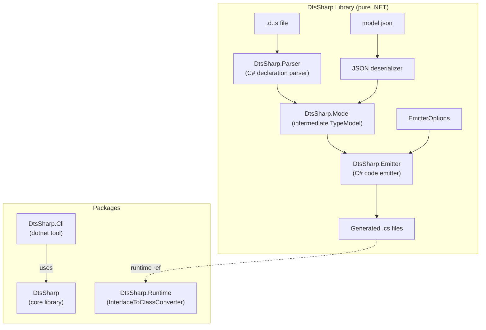

# Extract Emitter as General-Purpose .d.ts → C# Source Generator Library

## Overview

Extract the Monaco type emitter (`tools/MonacoTypeEmitter/`) into a standalone, general-purpose .NET library that converts TypeScript `.d.ts` declaration files into C# proxy/wrapper source files. The library must be pure .NET with **no Node.js/npm dependencies**.

### Current state
The existing pipeline is two stages:
1. **ts-morph extractor** (Node.js) — parses `.d.ts` → intermediate JSON model
2. **.NET CLI emitter** — reads JSON → emits C# files

Research shows the emitter is ~90% generic already. The intermediate JSON schema (`model.ts` / `MonacoModel.cs`) is fully language-agnostic. Only ~6 coupling points are Monaco-specific (hardcoded paths, converter references, TypeDoc URLs, root namespace stripping).

### Target state
A standalone NuGet-packaged .NET library + CLI tool that:
- Accepts `.d.ts` files directly as input (no Node.js required)
- Parses declarations via a purpose-built C# parser for the `.d.ts` subset of TypeScript
- Emits C# proxy types (interfaces, classes, enums, type aliases) with STJ serialization attributes
- Is configurable via an options object (namespaces, type mappings, doc links, converter references)
- Ships a small runtime companion package for emitted code dependencies (`InterfaceToClassConverter`)

## Scope

**In scope:**
- New standalone solution with library, CLI tool, runtime, and parser projects
- C# declaration parser for `.d.ts` files (interfaces, classes, enums, type aliases, functions, namespaces, generics, unions/intersections, literals)
- Decoupled emitter with `EmitterOptions` configuration
- Runtime NuGet package for `InterfaceToClassConverter`
- CLI tool packaged as `dotnet tool`
- Migration of `uno.monaco.editor` to consume the extracted library
- Test suite with non-Monaco fixtures

**Out of scope (deferred):**
- Roslyn incremental source generator (future enhancement — reads JSON via `AdditionalTextsProvider`)
- Full TypeScript type checker (the parser extracts declarations, not semantic analysis)
- Declaration merging across multiple files (v1 handles single-file `.d.ts`)
- Conditional types, mapped types, template literal types in parser (emitter already falls back to `object`)

## Dependencies

- **fn-10** (Fix emitter edge cases, XML docs) — should complete first. fn-10 is actively improving `CSharpEmitter.cs` with exotic identifier handling and XML doc generation. Extract after those improvements land to avoid merge conflicts.

## Quick commands

```bash
# After extraction — build the library
dotnet build tools/DtsSharp/DtsSharp.slnx

# Run tests
dotnet test --project tools/DtsSharp/DtsSharp.Tests

# CLI usage: parse .d.ts and emit C#
dotnet run --project tools/DtsSharp/DtsSharp.Cli -- --input path/to/api.d.ts --output Generated/

# From uno.monaco.editor — regenerate Monaco types using extracted library
dotnet run --project tools/DtsSharp/DtsSharp.Cli -- --input node_modules/monaco-editor/monaco.d.ts --output MonacoEditorComponent/Monaco/ --ignore tools/MonacoTypeEmitter/.generator-ignore
```

## Acceptance

- [ ] Standalone library compiles and passes all tests with zero Monaco references in public API
- [ ] CLI tool accepts a `.d.ts` file and emits C# without Node.js
- [ ] `uno.monaco.editor` regenerated output is byte-for-byte identical using the extracted library
- [ ] Runtime companion package contains `InterfaceToClassConverter` in a generic namespace
- [ ] Library is configurable: root namespace, output prefix, converter type name, doc link provider
- [ ] `.d.ts` parser handles: interfaces, classes, enums, type aliases (string literal unions), functions, namespaces, generic type parameters, union/intersection types, array types, literal types, optional/readonly members
- [ ] Test suite includes non-Monaco `.d.ts` fixtures (at least 3 different libraries)
- [ ] CLI is packable as a `dotnet tool`

## Architecture



## Key design decisions

1. **Parser strategy**: Build a focused C# parser for `.d.ts` declaration syntax. This is feasible because `.d.ts` files contain only declarations (no implementation code), which is a bounded grammar. The parser produces the same intermediate model the emitter already consumes.

2. **Dual input**: The library accepts EITHER a `.d.ts` file (via parser) OR the intermediate JSON model. This preserves backward compatibility and lets users with complex setups (e.g., multi-file `.d.ts` with `/// <reference>` directives) use the ts-morph extractor to produce JSON.

3. **Package structure**: Three NuGet packages — core library (parser + emitter), runtime (converter), CLI tool. The runtime package is intentionally small (~30 lines) to minimize transitive dependency impact.

4. **EmitterOptions pattern**: Replace all Monaco-specific hardcoding with a configuration object. Follow the Options pattern per `tools/MonacoTypeEmitter/Emitter/CSharpEmitter.cs` constructor.

5. **Naming**: `DtsSharp` as working name (short, descriptive). Final name TBD.

## References

- Current emitter: `tools/MonacoTypeEmitter/Emitter/CSharpEmitter.cs`
- Current model: `tools/MonacoTypeEmitter/Model/MonacoModel.cs` (C#), `tools/monaco-type-extractor/src/model.ts` (TS)
- Type mapper: `tools/MonacoTypeEmitter/Emitter/TypeMapper.cs`
- Name mapper: `tools/MonacoTypeEmitter/Emitter/NameMapper.cs`
- Test infrastructure: `tools/MonacoTypeEmitter.Tests/`
- InterfaceToClassConverter: `MonacoEditorComponent/Helpers/InterfaceToClassConverter.cs`
- Similar projects: [alphaTab](https://github.com/CoderLine/alphaTab) (TS→C# transpiler), [fern](https://github.com/fern-api/fern) (multi-language SDK generator), [quicktype](https://github.com/glideapps/quicktype) (cross-language IR design)
