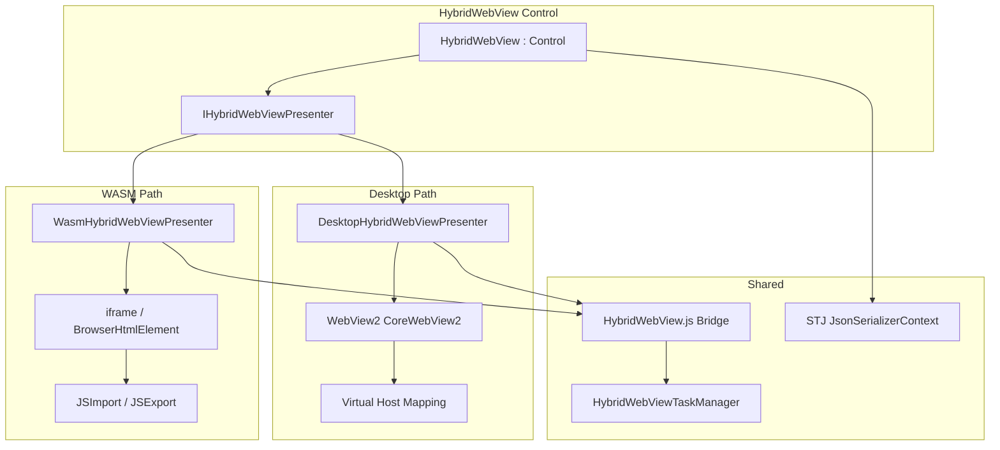

# Uno HybridWebView Control Library

## Overview

Create a new Uno Platform control library (`Uno.HybridWebView`) that ports .NET MAUI's HybridWebView functionality. The library enables hosting local web content (HTML/JS/CSS) inside an Uno app with bidirectional C#↔JS interop, targeting both WASM and Desktop platforms.

The library lives in this repository alongside `MonacoEditorComponent`, sharing build infrastructure (Directory.Build.props, CPM, CI). It follows the Presenter/Interface pattern established by MonacoEditorComponent — NOT MAUI's Handler/Mapper architecture.

**Source**: Adapted from [dotnet/maui HybridWebView](https://github.com/dotnet/maui/tree/main/src/Core/src/Handlers/HybridWebView) (MIT license, .NET Foundation).

## Scope

### In scope
- `HybridWebView` control with `DefaultFile`, `HybridRoot`, `SendRawMessage()`, `EvaluateJavaScriptAsync()`, `InvokeJavaScriptAsync<T>()`
- `IHybridWebViewPresenter` interface with Desktop and WASM implementations
- JS bridge script (`HybridWebView.js`) using postMessage protocol for both platforms
- Desktop presenter: WebView2 + `SetVirtualHostNameToFolderMapping` content serving
- WASM presenter: iframe + BrowserHtmlElement + JSImport/JSExport bridge
- Async JS invocation tracking (task manager with TaskCompletionSource)
- AOT/trimming safe: STJ source generators, no reflection-based dispatch
- MIT attribution in THIRD-PARTY-NOTICES or ThirdPartyNotices.txt
- NuGet package configuration
- Sample/validation page in MonacoEditorTestApp

### Out of scope (deferred)
- iOS/Android/macOS Catalyst handlers (MAUI covers those natively)
- `WebResourceRequested` event (complex, WASM has no equivalent)
- `SetInvokeJavaScriptTarget` reflection-based dispatch (replaced with explicit method registration)
- Developer tools support (`AddHybridWebViewDeveloperTools`)
- Client-side routing / SPA fallback support
- Separate CI jobs (extend existing pipeline)

## Architecture



## Key Decisions

1. **Presenter pattern** (not MAUI Handler/Mapper) — follows `MonacoEditorComponent/CodeEditor/ICodeEditorPresenter.cs`
2. **postMessage protocol** (not fetch-based) — works on both WebView2 and iframe; MAUI's fetch interception doesn't map to WASM
3. **iframe for WASM** — sandboxes user content, consistent with WebView2 on Desktop
4. **Explicit method registration** (not reflection) — AOT/trimming safe, replaces MAUI's `SetInvokeJavaScriptTarget`
5. **Shared repo** — lives alongside MonacoEditorComponent, shares build infra and CI
6. **MAUI-compatible JS API surface** — `window.HybridWebView.SendRawMessage()`, `InvokeDotNet()` but over postMessage instead of fetch

## Quick commands

```bash
# Build the new library
dotnet build HybridWebViewComponent/HybridWebViewComponent.csproj

# Build full solution including HybridWebView
dotnet build MonacoEditorComponent.slnx

# Build test app for validation
dotnet build MonacoEditorTestApp/MonacoEditorTestApp.csproj -f net10.0-browserwasm
dotnet build MonacoEditorTestApp/MonacoEditorTestApp.csproj -f net10.0-desktop
```

## Risks & Mitigations

| Risk | Mitigation |
|------|-----------|
| WASM iframe same-origin policy blocks postMessage | Use `srcdoc` or blob URL to keep iframe same-origin; fallback to BrowserHtmlElement if iframe blocks interop |
| WASM content serving: no file system access | Embed user content as static assets via MSBuild targets; serve from app base URL path |
| WebView2 not available on Linux desktop | Guard with platform check; show fallback message (follow MonacoEditorComponent's existing pattern) |
| Large payload OOM in postMessage | Enforce size limits consistent with MonacoEditorComponent (10MB) |
| Lifecycle races during init | Follow MonacoEditorComponent's deferred teardown and readiness gate patterns |

## Epic Dependencies

- **fn-1** (Desktop Skia target): architectural template for presenter pattern
- **fn-2** (STJ migration): serialization patterns to follow

## Acceptance

- [ ] `HybridWebViewComponent` project builds successfully as part of solution
- [ ] HybridWebView control renders local HTML content on Desktop (WebView2)
- [ ] HybridWebView control renders local HTML content on WASM (iframe)
- [ ] C#→JS: `EvaluateJavaScriptAsync` and `InvokeJavaScriptAsync<T>` work on both platforms
- [ ] JS→C#: `InvokeDotNet` dispatches to registered methods on both platforms
- [ ] Raw message exchange: `SendRawMessage` / `RawMessageReceived` work on both platforms
- [ ] NuGet package configuration present (GenerateLibraryLayout, package metadata)
- [ ] MIT attribution for dotnet/maui source in ThirdPartyNotices.txt
- [ ] AOT/trimming safe: no reflection, STJ source generators
- [ ] Sample page in MonacoEditorTestApp validates all interop paths

## References

- [MAUI HybridWebView source](https://github.com/dotnet/maui/tree/main/src/Core/src/Handlers/HybridWebView)
- [MAUI HybridWebView docs](https://learn.microsoft.com/en-us/dotnet/maui/user-interface/controls/hybridwebview)
- [MonacoEditorComponent ICodeEditorPresenter](MonacoEditorComponent/CodeEditor/ICodeEditorPresenter.cs)
- [MonacoEditorComponent WasmPresenter](MonacoEditorComponent/CodeEditor/WasmCodeEditorPresenter.cs)
- [MonacoEditorComponent DesktopPresenter](MonacoEditorComponent/CodeEditor/DesktopCodeEditorPresenter.cs)
