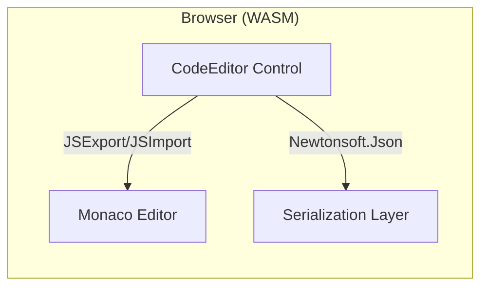
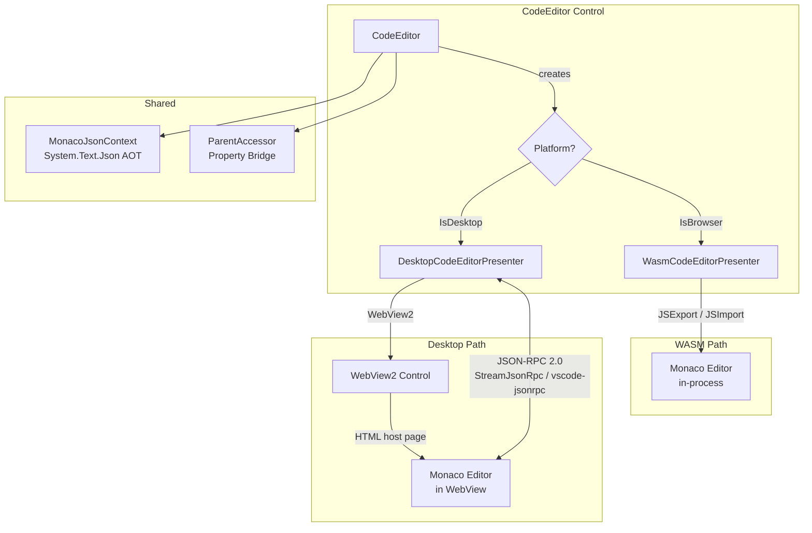
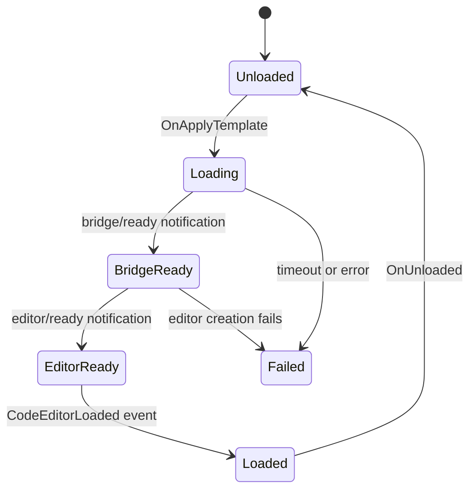

# PR Review Guide: Refactoring Branch

> **Branch**: `ralph-20260211-093916-012f`
> **Base SHA**: `fc42320b13ea6cd5ecc32a7ff172c005bc61e630` (merge-base with `main`)
> **Head SHA**: `99ff9c5df7f092909be40d313bf58f55348f136b`
> **Commits**: 150
> **Diff summary**: 526 files changed, 37,520 insertions, 71,918 deletions
> **Monaco version**: 0.52.2 (declared `^0.52.2` in `package.json`)

---

## Table of Contents

1. [Overview](#overview)
2. [Breaking Changes from 2.0.0-dev.60](#breaking-changes-from-200-dev60)
3. [Epic Summaries](#epic-summaries)
   - [fn-1: Desktop Skia Target](#fn-1-desktop-skia-target)
   - [fn-2: System.Text.Json Migration](#fn-2-systemtextjson-migration)
   - [fn-3: CI Modernization](#fn-3-ci-modernization)
   - [fn-4: Type Generation Pipeline](#fn-4-type-generation-pipeline)
4. [Architecture: Before and After](#architecture-before-and-after)
5. [Recommended Reading Order](#recommended-reading-order)
6. [Risk Assessment](#risk-assessment)
7. [Testing Coverage](#testing-coverage)
8. [Known Issues](#known-issues)
9. [Reviewer Checklist](#reviewer-checklist)

---

## Overview

This branch delivers four epics of work that collectively transform `uno.monaco.editor` from a WASM-only Monaco wrapper into a dual-platform (WASM + Desktop Skia) component with modern serialization, CI, and tooling.

**Package rename**: The NuGet package ID has changed from `Monaco.Editor` to `Uno.Monaco.Editor`. This is a breaking change for consumers.

**Target framework**: Consolidated from multi-TFM (`net8.0-*`) to single `net10.0` using runtime platform detection (`OperatingSystem.IsBrowser()`).

---

## Breaking Changes from 2.0.0-dev.60

| Change | Impact | Migration |
|--------|--------|-----------|
| NuGet ID `Monaco.Editor` renamed to `Uno.Monaco.Editor` | All consumers must update package references | Replace `Monaco.Editor` with `Uno.Monaco.Editor` in `.csproj` |
| Newtonsoft.Json removed; STJ is the sole serializer | Custom converters or serialization extensions using Newtonsoft will break | Migrate to `System.Text.Json`; use `MonacoJsonContext` for AOT |
| TFM consolidated to `net10.0` | Consumers on .NET 8 must upgrade | Target .NET 10 |
| `ICodeEditorPresenter` interface extracted | Casting to concrete types will break | Program against `ICodeEditorPresenter` |
| Platform-asymmetric APIs throw `PlatformNotSupportedException` on Desktop | `AddActionAsync`, `AddCommandAsync` fail at runtime on Desktop Skia | Guard with `OperatingSystem.IsBrowser()` or catch the exception |
| `MonacoJsonContext` source-gen context required for AOT | Direct `JsonSerializer.Serialize<T>()` without context fails in AOT | Use `MonacoJsonContext.Default` or register types in your own context |
| Nerdbank.GitVersioning version: `6.5.0-dev.{height}` | NuGet version scheme changed | No action needed; informational |

---

## Epic Summaries

### fn-1: Desktop Skia Target

**Goal**: Enable the Monaco editor on Desktop Skia (Windows, macOS, Linux) via WebView2 and a JSON-RPC bridge.

**Key commits** (chronological):
- `ad1b504` — Consolidate TFM to `net10.0`, migrate to runtime detection
- `c8fd4ec` — Presenter architecture: extract `ICodeEditorPresenter`, refactor `Generic.xaml`
- `41302a0` — Migrate to Monaco ESM with esbuild, add desktop JS bridge
- `b257659` — JS bridge dual-mode communication layer (WASM JSExport + Desktop JSON-RPC)
- `c6949b0` — Desktop C# bridge classes, platform guards for asymmetric APIs
- `b8355f7` — 94 unit tests for bridge/message handler
- `9fbea14` — Playwright integration tests for Desktop CDP and WASM

**Key files to review**:

| File | What to look for |
|------|------------------|
| `MonacoEditorComponent/CodeEditor/ICodeEditorPresenter.cs` | Interface surface; portable event args types |
| `MonacoEditorComponent/CodeEditor/DesktopCodeEditorPresenter.cs` | WebView2 lifecycle, navigation allowlist, JSON-RPC setup |
| `MonacoEditorComponent/CodeEditor/WasmCodeEditorPresenter.cs` | Renamed from `.wasm.cs`; unchanged WASM interop |
| `MonacoEditorComponent/CodeEditor/CodeEditor.cs` | Presenter factory, lifecycle state machine, init guards |
| `MonacoEditorComponent/DesktopContent/bridge-protocol.md` | JSON-RPC wire protocol specification (190 lines) |
| `MonacoEditorComponent/ts-helpermethods/` | ESM migration, esbuild entry points, dual-mode `postWebViewMessage()` |

**Architecture pattern**: The `CodeEditor` control owns an `ICodeEditorPresenter`. On WASM, `WasmCodeEditorPresenter` uses JSExport/JSImport for direct interop. On Desktop, `DesktopCodeEditorPresenter` embeds a WebView2, loads Monaco via an HTML host page, and communicates over JSON-RPC 2.0 (StreamJsonRpc on C#, vscode-jsonrpc on JS).

---

### fn-2: System.Text.Json Migration

**Goal**: Replace Newtonsoft.Json with System.Text.Json (STJ) for AOT compatibility and to eliminate the Newtonsoft dependency.

**Key commits** (chronological):
- `4bc5c76` — `MonacoJsonContext` source-gen context and STJ contract tests
- `9bdad99` — Migrate string enums to `JsonStringEnumMemberName`
- `efa1bcd` — Rewrite domain converters (color, position, range) for STJ
- `23625ce` — Migrate `JsonProperty` attributes to `JsonPropertyName`
- `3c782eb` — Migrate all call sites; redesign `ParentAccessor` for AOT
- `2930aec` **BREAKING** — Remove `Newtonsoft.Json` dependency entirely

**Key files to review**:

| File | What to look for |
|------|------------------|
| `MonacoEditorComponent/Serialization/MonacoJsonContext.cs` | Source-gen context; all registered types for AOT |
| `MonacoEditorComponent/Monaco/*.cs` | `[JsonPropertyName]` attributes replacing `[JsonProperty]` |
| `MonacoEditorComponent/Serialization/Converters/` | STJ converters for `CssColor`, `GlyphMarginLane`, etc. |
| `MonacoEditorComponent/Helpers/ParentAccessor.cs` | Redesigned for STJ; `SetValue`/`GetJsonValue` flow |

**Review focus**: Verify that the `MonacoJsonContext` registers all types that cross the serialization boundary. Missing registrations cause silent failures in AOT; the contract tests in `SerializationContractTests` validate round-trip fidelity.

---

### fn-3: CI Modernization

**Goal**: Replace the legacy CI workflow with GitHub Actions, add code coverage, and fix test infrastructure.

**Key commits** (chronological):
- `2e77127` — Initial CI modernization: GitHub Actions, code coverage, type generator replacement
- `1327326` — Fix Playwright browser install, commit `AppManifest.js`, split CI steps
- `0963c7a` — Set `PLAYWRIGHT_DRIVER_SEARCH_PATH` for test runtime
- `f3a991e` — Inline Playwright creation into fixtures for xUnit v3 compatibility
- `9d1bd4b` — Fix desktop-tests job to report green on headless CI
- `5371fa4` — Add code coverage collection and merged reporting
- `eadd0d3` — Add macOS ARM CI job
- `010b749` — Update runner images, action versions, SDK targets

**Key files to review**:

| File | What to look for |
|------|------------------|
| `.github/workflows/ci.yml` | Job matrix, coverage steps, workload installs |
| `.github/actions/nuget-uno-publish/action.yml` | NuGet publish action updates |
| `.github/actions/tag-release/action.yml` | Release tagging changes |

**Review focus**: The CI workflow now has multiple jobs (build, WASM tests, desktop tests, coverage merge). Desktop tests are marked `continue-on-error` because headless CI runners lack a GUI for WebView2.

---

### fn-4: Type Generation Pipeline

**Goal**: Replace the broken T4-based type generator with a new two-stage pipeline: ts-morph TypeScript extractor producing intermediate JSON, and a .NET CLI emitter producing C# source files.

**Key commits** (chronological):
- `323d8ee` — ts-morph Monaco type extractor (TypeScript)
- `45db184` — .NET CLI emitter for C# type emission
- `695be92` — Generator pipeline tests (snapshot + round-trip)
- `e2fe5cc` — Migrate off `GenerateMonacoTypings`, clean up legacy generator

**Key files to review**:

| File | What to look for |
|------|------------------|
| `tools/monaco-type-extractor/src/extractor.ts` | ts-morph AST walking, type literal handling |
| `tools/monaco-type-extractor/src/model.ts` | Intermediate JSON model schema |
| `tools/MonacoTypeEmitter/` | C# emitter: class/enum/interface emission, STJ attributes |
| `tools/MonacoTypeEmitter.Tests/` | Snapshot tests, round-trip validation |
| `MonacoEditorComponent/Monaco/` | 102 regenerated files (net -1,298 lines) |

**Review focus**: The regenerated Monaco types in `MonacoEditorComponent/Monaco/` should be treated as generated output. Review the generator pipeline (`tools/`) and spot-check a few generated files for correctness rather than reviewing all 102 files line-by-line.

---

## Architecture: Before and After

### Before (WASM-only, pre-refactoring)

The component was WASM-only, with direct JavaScript interop via `JSExport`/`JSImport` and Newtonsoft.Json for all serialization.

### After (Dual-platform)

**Key architectural decisions**:
- `ICodeEditorPresenter` abstracts platform differences; the `CodeEditor` control is platform-agnostic
- Desktop uses JSON-RPC 2.0 over WebView2 message channels (not `ExecuteScriptAsync` eval-style for most operations)
- STJ source-gen context (`MonacoJsonContext`) enables AOT-compatible serialization on both platforms
- TypeScript helpers are compiled via esbuild into an IIFE bundle; desktop loads this bundle via an HTML host page

### Lifecycle State Machine

On WASM, the `BridgeReady` and `EditorReady` states are implicit (synchronous JS interop). On Desktop, they correspond to JSON-RPC handshake messages defined in `bridge-protocol.md`.

---

## Recommended Reading Order

Given the size of the diff (526 files, 150 commits), a full sequential review is impractical. The recommended approach is **file-group review by epic**, prioritizing high-risk areas.

### Approach A: By Epic (Recommended)

1. **fn-1 Presenter Architecture** (highest risk, most new code)
   - Start with `ICodeEditorPresenter.cs` to understand the abstraction
   - Read `DesktopCodeEditorPresenter.cs` (478 new lines) for WebView2 lifecycle and security
   - Read `CodeEditor.cs` for presenter factory and init guards
   - Read `bridge-protocol.md` for the wire protocol spec
   - Scan TS helpers for ESM migration and dual-mode messaging

2. **fn-2 Serialization Migration** (correctness risk)
   - Read `MonacoJsonContext.cs` to verify all types are registered
   - Spot-check `Monaco/*.cs` for `[JsonPropertyName]` correctness
   - Read domain converters in `Serialization/Converters/`
   - Review `ParentAccessor.cs` for the STJ call-site migration

3. **fn-4 Type Generation** (generated output -- spot-check only)
   - Review `tools/monaco-type-extractor/src/extractor.ts` for extraction logic
   - Review `tools/MonacoTypeEmitter/` for emission patterns
   - Spot-check 2-3 generated files in `MonacoEditorComponent/Monaco/`
   - Review snapshot tests in `tools/MonacoTypeEmitter.Tests/`

4. **fn-3 CI** (low risk, operational)
   - Review `.github/workflows/ci.yml` for job correctness
   - Verify coverage merge step

### Approach B: By Commit (Chronological)

Follow `git log main..HEAD --oneline` in reverse order. The commits are organized by epic and each has a conventional commit prefix indicating scope.

---

## Risk Assessment

### High Risk

| Area | Risk | Mitigation |
|------|------|------------|
| Desktop presenter lifecycle | Init/teardown ordering bugs; WebView2 async gotchas | 94 unit tests + Playwright integration tests; idempotency guards |
| STJ AOT registration | Missing type in `MonacoJsonContext` causes silent runtime failure | `SerializationContractTests` validates round-trip for all registered types |
| Navigation allowlist | Security bypass via scheme/subdomain manipulation | Strict URI origin matching (scheme + exact host + port); file:// path validation |
| JSON-RPC bridge | Message corruption or desync between C# and JS sides | StreamJsonRpc handles correlation/timeout; bounded channel prevents DoS |

### Medium Risk

| Area | Risk | Mitigation |
|------|------|------------|
| ESM bundle loading | esbuild output not loading correctly on one platform | Tested on WASM (Playwright) and Desktop (manual validation) |
| Platform-asymmetric APIs | `PlatformNotSupportedException` surprises at runtime | Documented; guard pattern shown in codebase |
| Type generator output | Incorrect C# emission for edge-case Monaco types | Snapshot tests pin expected output; `CursorStyle` and `BuiltinTheme` are on the ignore list (hand-tuned) |

### Low Risk

| Area | Risk | Mitigation |
|------|------|------------|
| CI workflow | Job failures on new runner images | `continue-on-error` on desktop tests; macOS ARM job added |
| Package rename | Consumers not finding package | Documented as breaking change |

---

## Testing Coverage

### Unit Tests

| Test Project | Count | Scope |
|-------------|-------|-------|
| `MonacoEditorComponent.Tests` | 94 | `WebView2JsonRpcMessageHandler`, bridge protocol, message validation |
| `tools/MonacoTypeEmitter.Tests` | ~30 | Snapshot tests, round-trip validation, generator pipeline |
| `SerializationContractTests` | ~20 | STJ round-trip for all Monaco model types |

### Integration Tests (Playwright)

| Test Suite | Platform | Coverage |
|-----------|----------|----------|
| `WasmIntegrationTests` | WASM (Chromium) | Editor load, text manipulation, theme switching |
| `WasmResizeRegressionTests` | WASM (Chromium) | ResizeObserver-based layout |
| Desktop CDP tests | Desktop (WebView2) | Editor load, language service, markers, keyboard |

### Manual Validation

- macOS Desktop: editor loads, text editing, theme switching, language service completion
- WASM: full functional validation in browser
- Linux Desktop: **known gap** -- no Linux validation environment available

---

## Known Issues

1. **`HasGlyphMargin` XML doc copy-paste error** (`CodeEditor.Properties.cs:137`): The `
` says "Get or Set the CodeEditor Text" instead of describing the glyph margin property. This is a pre-existing issue documented for a future docs task.

2. **Desktop `AddActionAsync` / `AddCommandAsync`**: These throw `PlatformNotSupportedException` on Desktop Skia. The JSON-RPC bridge does not yet support the callback registration pattern these APIs require.

3. **Desktop tests marked `continue-on-error`**: Headless CI runners do not have a GUI, and WebView2 requires a display context. Desktop tests pass locally but may fail in CI.

4. **SYSLIB1031 suppression**: STJ source generator diagnostics cannot be suppressed via `#pragma` (they are emitted on generated files). Suppressed at project level with a documented rationale and a safety test.

---

## Reviewer Checklist

Use the severity labels from the dotnet/runtime 3-step review pattern:

- **[error]** -- Must fix before merge
- **[warning]** -- Should fix; can merge with tracking issue
- **[suggestion]** -- Nice to have; optional

### fn-1: Desktop Skia Target

- [ ] `ICodeEditorPresenter` interface surface is minimal and well-documented
- [ ] `DesktopCodeEditorPresenter` navigation allowlist uses strict origin matching
- [ ] WebView2 `Source` is not set before `EnsureCoreWebView2Async` completes
- [ ] `InitialiseWebObjects` is idempotent; teardown is field-state-driven
- [ ] JSON-RPC lifecycle: `bridge/ready` before `editor/ready`; timeout handling
- [ ] `PostWebMessage` / `MessageReceived` transport binding is correct per platform
- [ ] Bounded channel used for inbound message queue
- [ ] `async void` event handlers have try/catch
- [ ] Presenter event handlers survive unload/load cycles

### fn-2: Serialization

- [ ] `MonacoJsonContext` registers all types crossing the serialization boundary
- [ ] `[JsonPropertyName]` attributes match the Monaco JS property names
- [ ] Domain converters (`CssColor`, positions, ranges) handle edge cases (out-of-range values, null)
- [ ] `ParentAccessor` encoding/decoding happens at exactly one layer (no double-encoding)
- [ ] `ConcurrentDictionary` used for runtime type registries
- [ ] Catch-all handlers exclude STJ metadata exceptions for AOT debugging

### fn-3: CI

- [ ] All CI jobs install required workloads (`wasm-tools`)
- [ ] Playwright browser install uses correct driver path
- [ ] Coverage merge step collects from all test jobs
- [ ] Desktop tests are `continue-on-error` (expected to fail headless)

### fn-4: Type Generation

- [ ] ts-morph extractor handles type literals, methods, and properties separately
- [ ] Emitter produces `[JsonPropertyName]` attributes on all emitted types
- [ ] `CursorStyle` and `BuiltinTheme` are on the ignore list (hand-tuned enums)
- [ ] Snapshot tests pin expected output for regression detection
- [ ] Legacy `GenerateMonacoTypings` target is fully removed

### Cross-Cutting

- [ ] No Newtonsoft.Json references remain in the library (tests may retain for comparison)
- [ ] `PlatformNotSupportedException` documented on all platform-asymmetric APIs
- [ ] Conventional commit messages used throughout
- [ ] No secrets or credentials in committed files
