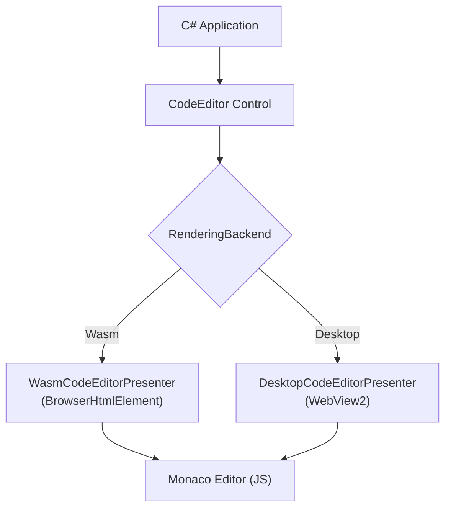
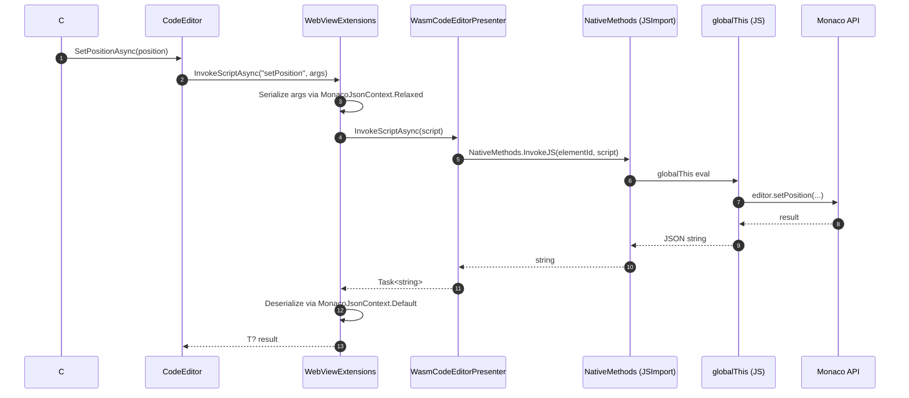
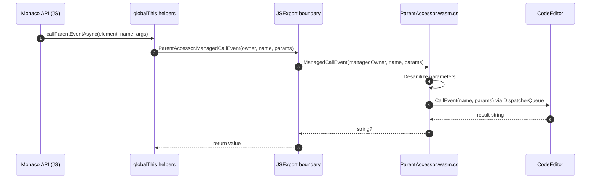
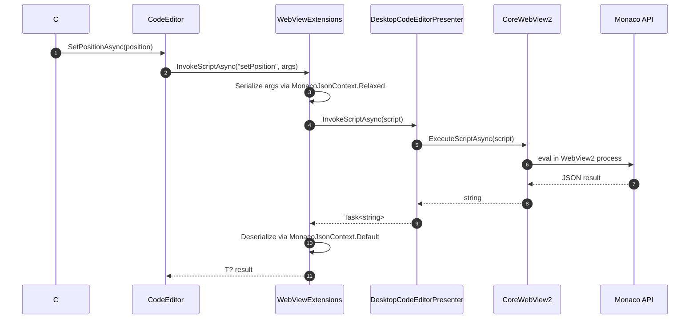
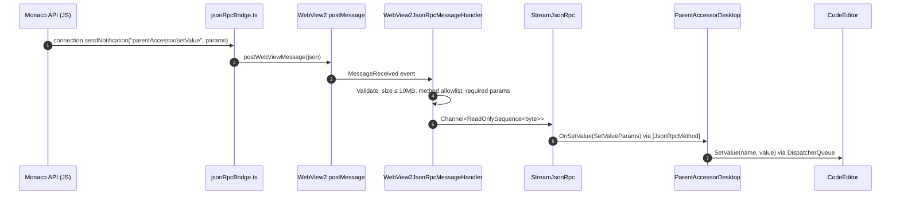
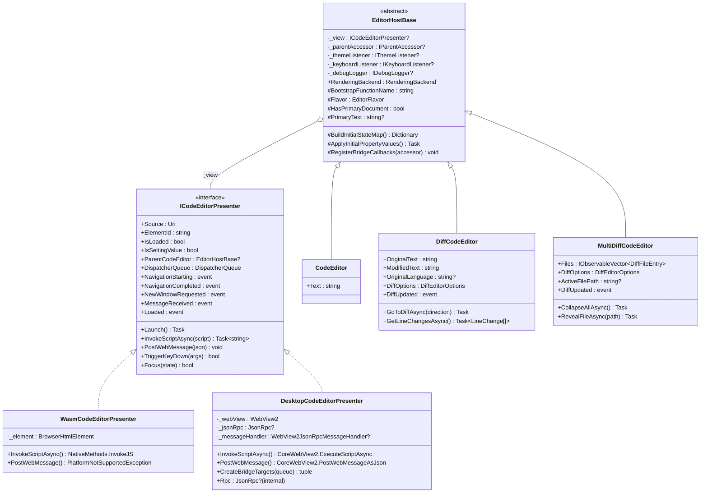
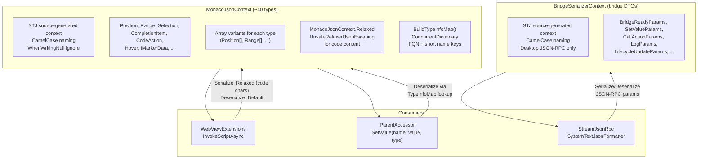

# Architecture

This document describes the internal architecture of the `Uno.Monaco.Editor` control, covering the component layer model, dual-platform interop paths, editor lifecycle, presenter pattern, and serialization layer.

For the JSON-RPC wire protocol used on desktop, see [bridge-protocol.md](../MonacoEditorComponent/DesktopContent/bridge-protocol.md).

## System Overview

The control wraps the [Monaco Editor](https://microsoft.github.io/monaco-editor/) inside a platform-appropriate web host. A `RenderingBackend` enum (set automatically at construction time via `OperatingSystem.IsBrowser()`) selects which presenter implementation is used.



Key layers from top to bottom:

| Layer | Responsibility |
|-------|---------------|
| **C# Application** | Consumes `CodeEditor` control, sets properties, subscribes to events |
| **EditorHostBase** | Abstract templated `Control`; owns lifecycle, property sync, bridge helper wiring |
| **CodeEditor** | Thin single-document subclass of `EditorHostBase`; adds the `Text` property |
| **DiffCodeEditor** | Side-by-side diff subclass of `EditorHostBase`; adds the `OriginalText`/`ModifiedText` properties |
| **MultiDiffCodeEditor** | Multi-file diff subclass of `EditorHostBase`; adds the `Files` collection of `DiffFileEntry` |
| **ICodeEditorPresenter** | Abstraction over the web host; two implementations selected by platform |
| **WasmCodeEditorPresenter** | WASM: wraps `BrowserHtmlElement` (iframe-like DOM element) |
| **DesktopCodeEditorPresenter** | Desktop (Skia): wraps `WebView2` with CoreWebView2 |
| **Monaco Editor** | The JavaScript editor running inside the web host |

## Dual-Platform Interop

The control communicates with Monaco through two fundamentally different interop paths depending on the platform. Both paths provide the same high-level capabilities (property sync, action dispatch, event callbacks) but use different transport mechanisms.

### WASM Interop Path

On WebAssembly, .NET and JavaScript share the same browser process. Communication uses `JSImport`/`JSExport` attributes (part of the .NET WASM interop layer) for direct interop calls (synchronous or asynchronous depending on the API).



**JS to C# (WASM):** Monaco calls back into .NET through `JSExport`-decorated static methods on `ParentAccessor.wasm.cs`. A `ConditionalWeakTable` maps the JS-passed managed owner reference to the correct `ParentAccessor` instance.



### Desktop Interop Path

On desktop (Skia), Monaco runs inside a WebView2 process. Communication uses two mechanisms:

- **C# to JS:** `CoreWebView2.ExecuteScriptAsync` (eval-style, same API shape as WASM)
- **JS to C#:** JSON-RPC 2.0 over WebView2 `postMessage`/`WebMessageReceived` transport, powered by `StreamJsonRpc` (C#) and `vscode-jsonrpc` (JS)



**JS to C# (Desktop):** Monaco sends JSON-RPC notifications/requests through the bridge transport. Messages flow through a validation layer before reaching StreamJsonRpc.



### Platform API Parity

All public `EditorHostBase` APIs work identically on WASM and desktop. The unified `InvokeMethodAsync` on `ICodeEditorPresenter` handles element resolution per-platform, ensuring scripts reference the correct editor element on both transport paths.

| API | WASM | Desktop | Notes |
|-----|------|---------|-------|
| `AddActionAsync` | Supported | Supported | Action callbacks routed through `ParentAccessor` on both platforms |
| `AddCommandAsync` | Supported | Supported | Command callbacks routed through `ParentAccessor` on both platforms |
| `PostWebMessage` | `PlatformNotSupportedException` | Supported | WASM uses JSExport direct calls instead (internal transport, not public API) |
| `ICodeEditorPresenter.MessageReceived` | Never fires | Fires from WebMessageReceived | WASM callbacks bypass message events entirely (internal transport detail) |

## Lifecycle State Machine

The editor follows a three-state lifecycle managed by `EditorLifecycleState`. Transitions are enforced by `TransitionLifecycle()` which fires events exactly once per cycle.

```mermaid
stateDiagram-v2
    [*] --> Unloaded

    Unloaded --> Loading : InitialiseWebObjects succeeds
    Loading --> Loaded : Navigation completes or<br/>CodeEditorLoaded callback
    Loaded --> Unloaded : CodeEditor_Unloaded or<br/>OnApplyTemplate (re-template)

    Unloaded --> Unloaded : TeardownWebObjects (idempotent)

    state Unloaded {
        direction LR
        note right of Unloaded
            IsEditorLoaded = false
            _initialized = false
        end note
    }

    state Loading {
        direction LR
        note right of Loading
            EditorLoading event fires (once)
            Bridge helpers wired
        end note
    }

    state Loaded {
        direction LR
        note right of Loaded
            EditorLoaded event fires (once)
            IsEditorLoaded = true
            _initialized = true
        end note
    }
```

**Initialization sequence:**

1. `OnApplyTemplate` creates the presenter (`WasmCodeEditorPresenter` or `DesktopCodeEditorPresenter`) and attaches navigation event handlers.
2. `WebView_DOMContentLoaded` (or presenter `Loaded`) calls `InitialiseWebObjects()`, which creates bridge helpers and transitions to `Loading`.
3. The presenter's `Launch()` method is called (WASM: `createMonacoEditor` via JSImport; Desktop: `EnsureCoreWebView2Async` + security settings).
4. On navigation completion (`WebView_NavigationCompleted`) or the `"Loaded"` callback from JS, the lifecycle transitions to `Loaded`.

**Desktop initialization handshake (informational):**

On desktop, two JSON-RPC notifications are observed during initialization. These are currently informational signals logged by `BridgeHandshakeTarget` -- they do not drive lifecycle state transitions (which are driven by `WebView_NavigationCompleted` and the `"Loaded"` callback):
- `bridge/ready` (typically arrives at IIFE bundle load, before any editor exists)
- `editor/ready` (typically arrives after `createMonacoEditor()` completes)

See [bridge-protocol.md](../MonacoEditorComponent/DesktopContent/bridge-protocol.md) for the full handshake specification.

## Presenter Pattern

The presenter pattern decouples the editor control from platform-specific web host implementations.
`EditorHostBase` holds the presenter and every bridge helper, so the presenter contract is shared by
every derived control -- `CodeEditor` for a single document, `DiffCodeEditor` for a side-by-side diff.



`EditorHostBase` owns everything identical across editor flavors: presenter creation and reuse,
the initialization handshake and its recovery paths, the bridge helpers, theming, decorations,
markers, and script invocation. A derived control supplies only its bootstrap entry point and
its own text properties, so adding one costs no new lifecycle code.

`DiffCodeEditor` bootstraps through `createMonacoDiffEditor` instead of `createMonacoEditor`. On
the JS side the diff widget's modified sub-editor is aliased onto `EditorContext.editor` -- it is
already an `IStandaloneCodeEditor`, the field's declared type -- so every existing helper
(`updateContent`, `updateLanguage`, decorations, selection tracking, the `editor/getValue` RPC
handler) operates unchanged on the editable side of the diff. No JSON-RPC method was added for
the diff editor; `DiffUpdated` rides the existing `parentAccessor/callAction`.

### Multi-file diff

`MultiDiffCodeEditor` renders N file diffs in one scrollable, virtualized, collapsible list,
inside a single WebView. One control rather than N `DiffCodeEditor`s: on desktop each control
owns its own WebView2, so a list of them would mean N WebView2s and N independent scrollbars.

It has no primary document, so it overrides `HasPrimaryDocument` to `false`. That flag gates the
single-document half of `BuildInitialStateMap` and `ApplyInitialPropertyValues`: everything past
the theme push targets `EditorContext.editor`, which this element does not have. For the same
reason the members it inherits for a single document -- `SelectedText`, `Decorations`, `Markers`,
`Options`, `CodeLanguage`, `ReadOnly`, cursor position, actions, commands -- are inert and
documented as such. Monaco pools and recycles the per-file editors through an `ObjectPool`, so
there is no stable single editor to alias the way `DiffCodeEditor` aliases its modified side.

#### Why it does not call `createMultiFileDiffEditor`

Monaco ships the widget and `monaco.editor.createMultiFileDiffEditor` is declared in
`monaco.d.ts` -- returning `any` -- but the factory is unusable. Monaco's build tree-shakes at
`ShakeLevel.ClassMembers`, and `MultiDiffEditorWidget` keeps only its constructor: `setViewModel`,
`createViewModel`, `layout` and `reveal` are absent from both the ESM output and the min bundle.
It also hardcodes `{}` as the `IWorkbenchUIElementFactory` and builds its impl eagerly in that
constructor, so filename headers could never be populated through it.

`MultiDiffEditorWidgetImpl` -- the class that actually renders -- survived intact, so
`ts-helpermethods/multiDiffEditor.ts` constructs that directly. Same widget, same DOM, same CSS:
the `monaco-editor` barrel already pulls both in whether we use them or not, which is why the
feature cost about 11 KB of JS and no CSS at all. Only `MultiDiffEditorViewModel` was
tree-shaken out and is reached by a deep import.

**If a Monaco bump breaks this, it breaks silently** -- the factory is typed `any` and esbuild
strips types without checking them. `assertMonacoInternals()` and a post-construction DOM check
turn that into a thrown error instead. Both point back here.

#### Four things that fail silently

1. **The theme container must be registered.** `StandaloneThemeService` only injects its
   `<style class="monaco-colors">` -- which carries both the `--vscode-*` variables *and* the
   runtime-generated codicon glyph rules -- when an editor container is registered. Only
   `createStandaloneEditor`, `createStandaloneDiffEditor` and `colorize*` do that; `setTheme`
   does not. Without it the widget renders with serif headers, no syntax colours, no diff
   highlighting and an invisible collapse chevron. Note it is `StandaloneServices.get(...)`, not
   the `InstantiationService` that `initialize()` returns -- that one has no `get`.
2. **The side discriminator belongs in the model URI's authority, never its path.** The item
   template flags a rename whenever `originalUri.path !== modifiedUri.path`, so
   `multidiff://ctx/original/<path>` badges every modified file as `R`. The scheme used is
   `multidiff://<contextId>-original/<path>`.
3. **Removed documents are disposed a frame after the list swap**, not during it, or Monaco
   throws `TextModel got disposed before DiffEditorWidget model got reset`.
4. **The widget does not self-size.** It builds `ObservableElementSizeObserver(element, undefined)`
   and never calls `setAutomaticLayout(true)`, so the `ResizeObserver` behind `startObserving()`
   never runs. A fresh `Dimension` is pushed from the existing `attachEditorRuntime`
   `ResizeObserver`; re-setting an equal value does not retrigger the autorun.

Scroll offsets are in *content* space: `render` compares the viewport against an accumulator over
full content heights, and `setScrollDimensions` reports `scrollHeight` the same way. Reveal sums
full content heights, not viewport-clamped ones.

The TypeScript layer owns every `ITextModel`; C# only ever sends text. URIs are stable and
derived from `DiffFileEntry.Path`, which is what preserves each file's scroll offset and
collapsed state across a re-push -- `updateMultiDiffFiles` reconciles by path and keeps the same
document object for an unchanged file, because `mapObservableArrayCached` caches by identity.
`createModel` throws on a duplicate URI, so every create goes through `getModel` first.

A `null` original or modified text omits that side's model entirely, which is what produces the
`A`/`D` badge; `""` is a real but empty file. As with the diff editor, no JSON-RPC method was
added -- the collapse and focus callbacks ride `parentAccessor/callActionWithParameters`.

### Bridge Helpers

Bridge helpers mediate between the JavaScript runtime and the C# control. Each helper has a WASM variant (using `JSExport` static methods with `ConditionalWeakTable` instance lookup) and a desktop variant (using `[JsonRpcMethod]` attributes for StreamJsonRpc dispatch).

```mermaid
classDiagram
    class IParentAccessor {
        <<interface>>
        +RegisterAction(name, action)
        +RegisterActionWithParameters(name, action)
        +RegisterEvent(name, function)
        +RegisterTypeInfo(name, info)
        +GetValue(name) Task~object?~
        +GetJsonValue(name) string
        +SetValue(name, value) Task
        +SetValue(name, value, type) Task
        +CallAction(name) bool
        +CallEvent(name, params) Task~string?~
    }

    class IThemeListener {
        <<interface>>
        +CurrentThemeName : string
        +CurrentTheme : ApplicationTheme
        +IsHighContrast : bool
        +ThemeChanged : event
    }

    class IKeyboardListener {
        <<interface>>
        +KeyDown(keycode, ctrl, shift, alt, meta) bool
    }

    class IDebugLogger {
        <<interface>>
        +Log(message)
    }

    class ParentAccessor {
        WASM: JSExport static methods
        ConditionalWeakTable lookup
    }

    class ParentAccessorDesktop {
        Desktop: [JsonRpcMethod] targets
        StreamJsonRpc dispatch
    }

    class ThemeListener {
        WASM: JSExport static methods
    }

    class ThemeListenerDesktop {
        Desktop: [JsonRpcMethod] targets
    }

    class KeyboardListener {
        WASM: JSExport static methods
    }

    class KeyboardListenerDesktop {
        Desktop: [JsonRpcMethod] targets
    }

    class DebugLogger {
        WASM: JSExport static methods
    }

    class DebugLoggerDesktop {
        Desktop: [JsonRpcMethod] targets
    }

    IParentAccessor <|.. ParentAccessor
    IParentAccessor <|.. ParentAccessorDesktop
    IThemeListener <|.. ThemeListener
    IThemeListener <|.. ThemeListenerDesktop
    IKeyboardListener <|.. KeyboardListener
    IKeyboardListener <|.. KeyboardListenerDesktop
    IDebugLogger <|.. DebugLogger
    IDebugLogger <|.. DebugLoggerDesktop
```



**Creation paths:**

| Platform | Factory | Registration |
|----------|---------|-------------|
| WASM | `BridgeFactory.Create(presenter, queue)` | Helpers registered in `ConditionalWeakTable` keyed by presenter instance |
| Desktop | `DesktopCodeEditorPresenter.CreateBridgeTargets(queue)` | Helpers registered as `JsonRpc.AddLocalRpcTarget()` for StreamJsonRpc dispatch |

## Serialization Layer

The control uses System.Text.Json (STJ) source generation for AOT-compatible serialization across the interop boundary. Two separate `JsonSerializerContext` classes handle different scopes.



### Serialization paths

| Path | Context | Encoder | Usage |
|------|---------|---------|-------|
| C# to JS (script building) | `MonacoJsonContext.Relaxed` | `UnsafeRelaxedJsonEscaping` | Serializing args for `InvokeScriptAsync` eval strings; avoids escaping `<`, `>`, `&` in code content |
| JS to C# (result parsing) | `MonacoJsonContext.Default` | Default (safe) | Deserializing return values from `InvokeScriptAsync` |
| JS to C# (typed SetValue) | `MonacoJsonContext.Default` via `BuildTypeInfoMap()` | Default (safe) | `ParentAccessor.SetValue(name, json, typeName)` looks up `JsonTypeInfo` by FQN or short name |
| Desktop JSON-RPC | `BridgeSerializerContext.Default` | Default (safe) | `SystemTextJsonFormatter` for StreamJsonRpc serialization of bridge DTOs |

### AOT safety

- `MonacoJsonContext.BuildTypeInfoMap()` builds a `ConcurrentDictionary<string, JsonTypeInfo>` at construction time, keyed by both fully-qualified name (e.g., `"Monaco.Position"`) and short name (e.g., `"Position"`) for backward compatibility with JS callers.
- Runtime `Type.GetType()` is never used for deserialization. All type resolution goes through the pre-built map.
- Consumer code can register additional types via `IParentAccessor.RegisterTypeInfo()`.

## TypeScript Bundle Structure

The JavaScript side is built as a single IIFE bundle (`uno-monaco-helpers.js`) from `MonacoEditorComponent/ts-helpermethods/index.ts` using esbuild.

**Build modes:** a one-shot build (`npm run build`, the MSBuild targets, `install-dependencies.ps1`, CI) is a production build — minified, no source maps, third-party license banners preserved at end-of-file (`legalComments: 'eof'`). `npm run build:watch` is a development build — unminified with inline source maps. Overrides: `--no-minify`, `--minify`, `--sourcemap` (or `npm run build:dev` for an unminified, mapped one-shot build). Note that MSBuild only compares timestamps, so run `npm run build` before a Release build or `dotnet pack` if you last ran a watch/dev build.

**Module layout:**

| Module | Responsibility |
|--------|---------------|
| `index.ts` | Entry point; imports Monaco ESM, configures workers via `MonacoEnvironment.getWorker`, assigns ~50 functions to `globalThis`, auto-inits bridge on desktop |
| `asyncCallbackHelpers.ts` | `createMonacoEditor` / `createMonacoDiffEditor` over a shared bootstrap and a shared `attachEditorRuntime`, `InvokeJS`, sanitize/desanitize, parent accessor call helpers |
| `otherScriptsToBeOrganized.ts` | `EditorContext`, editor manipulation functions (updateContent, updateOptions, etc.), theme accessor helpers |
| `registerCompletionItemProvider.ts` | Completion provider bridge |
| `registerCodeActionProvider.ts` | Code action provider bridge |
| `registerCodeLensProvider.ts` | Code lens provider bridge |
| `registerColorProvider.ts` | Color provider bridge |
| `updateSelectedContent.ts` | Selection content bridge |
| `bridge/jsonRpcBridge.ts` | `vscode-jsonrpc` connection management (`createBridgeConnection`, `isDesktopHost`, `getConnection`) |

**Desktop auto-init sequence:**

1. Bundle IIFE executes, `isDesktopHost()` returns true
2. `createBridgeConnection()` establishes the `vscode-jsonrpc` connection over `postMessage`
3. `connection.listen()` starts the message loop
4. `connection.sendNotification('bridge/ready', { protocolVersion: 1 })` signals transport readiness
5. After `createMonacoEditor()` completes, `connection.sendNotification('editor/ready', { protocolVersion: 1 })` signals editor readiness

**globalThis assignments:** All public functions are explicitly assigned to `globalThis` (not via esbuild `globalName`) so that both `JSImport("globalThis.*")` (WASM) and `ExecuteScriptAsync` eval (Desktop) can call them.
